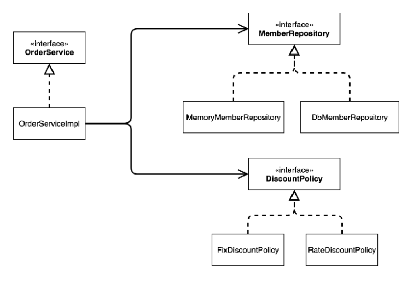

# 학습 목적
개발자가 좋은 객체 지향 애플리케이션을 개발할 수 있도록 도와주는 스프링 프레임워크의 핵심 원리와 기능을 객체 지향 설계의 관점에서 이해한다.

## 학습 목차

- [객체 지향 설계와 스프링](#객체-지향-설계와-스프링)
- [스프링 컨테이너와 스프링 빈](#스프링-컨테이너와-스프링-빈-지향-설계와-스프링)
- [싱글톤 컨테이너](#싱글톤-컨테이너)
- [컴포넌트 스캔](#컴포넌트-스캔)
- [의존관계 자동 주입](#의존관계-자동-주입)
- [빈 생명주기 콜백](#빈-생명주기-콜백)
- [빈 스코프](#빈-스코프)
---
### 객체 지향 설계와 스프링

 #### 좋은 객체 지향 설계로 유명한 5가지 원칙 SOLID가 있다.

- SRP(Single Responsibility Principle) 단일 책임 원칙
    
    한 클래스는 하나의 책임만 가져야 한다. 여기서 책임이라는 것은 기준이 모호하기 때문에 중요한 기준은 **변경**이다.
    변경이 있을 때 파급효과가 적으면 원칙을 잘 지킨 것이다.
    
- OCP(Open/Closed Principle) 개방-폐쇄 원칙

    소프트웨어 요소는 확장에는 열려 있으나 변경에는 닫혀 있어야 한다. 소프트웨어를 설계할 당시에, 다형성을 활용하기 위해 역할과 구현을 인터페이스와 구현체로 나눔으로써
    만족 시킬 수 있다.
    
- LSP(Liskov Substitution Principle) 리스코프 치환 원칙

    프로그램의 객체는 프로그램의 정확성을 깨뜨리지 않으면서 하위 타입의 인스턴스를 바꿀 수 있어야 한다. 단순히 컴파일이 되는 것이 아니라 규약을 지키는것
    
    ex)자동차의 인터페이스인 엑셀은 앞으로 가라는 규약, 뒤로 간다면 위반
    
- ISP(Interface Segregation Principle) 인터페이스 분리 원칙

    특정 클라이언트를 위한 인터페이스 여러 개가 범용 인터페이스 한개 보다 낫다. 인터페이스가 명확해지고, 대체 가능성이 높아진다는 장점을 가진다.
  
- DIP(Dependency Inversion Principle) 의존관계 역전 원칙

    프로그래머는 **구체화가 아닌, 추상화에 의존해야 한다**. 대표적으로 의존성 주입이 이 원칙을 따르는 방법중 하나다. 구체 클래스가 아닌 인터페이스에 의존해야 한다는 의미이다.
    
 #### 스프링에서 왜 객체 지향이 언급될까?
 
- 사실 스프링이 없던 시절에는 개발자가 객체 지향 설계 원칙을 지키면서 개발하기에 매우 할일이 많았다. 결국 에플리케이션을 주요기능을 개발하는 것보다 이 원칙들을 지키기 위한
개발들에 더 많은 시간을 소비하게 되고, 스프링이라는 프레임워크가 만들어지는 계기가 된다.
-  스프링은 다음과 같은 기술로 다형성 + OCP, DIP를 가능하게 지원한다.
  
    - DI(Dependency Injection): 의존관계 주입
    - DI 컨테이너 제공

-  클라이언트 코드의 변경 없이 기능 확장
-  애플리케이션을 개발하는 과정에서 부품을 교체하듯이 개발

 #### 클래스 모델링
 
 
 - OrderService라는 역할과 구체인 OrderServiceImpl을 나눔
 - OrderServiceImpl은 저장소인 MemberRepository와 할인정책인 DiscountPolicy
 - 결과적으로 OrderServiceImpl이라는 클라이언트는 어떤 저장소와 할인정책을 사용할지 모르고 외부에서 설정한 것들을 사용하게 되어있음
 - DIP 의존관계 역전 원칙을 지켰다고 할 수 있다. 
 
### 스프링 컨테이너와 스프링 빈

### 싱글톤 컨테이너

### 컴포넌트 스캔

### 의존관계 자동 주입

### 빈 생명주기 콜백

### 빈 스코프
