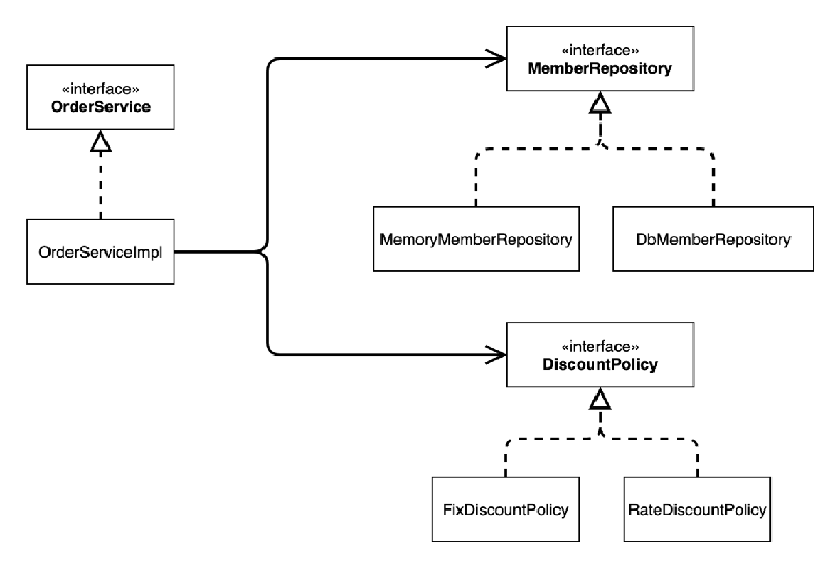
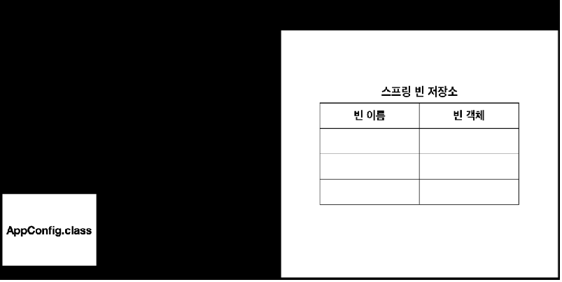
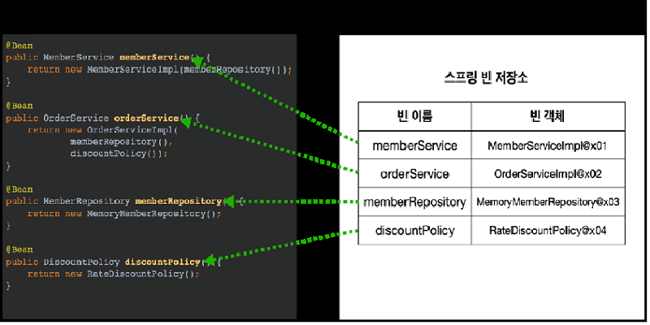
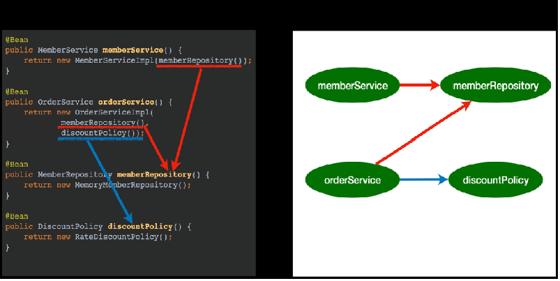
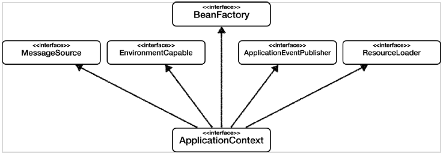
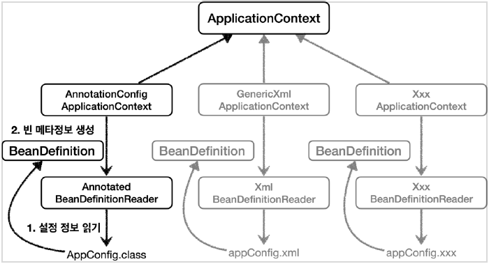
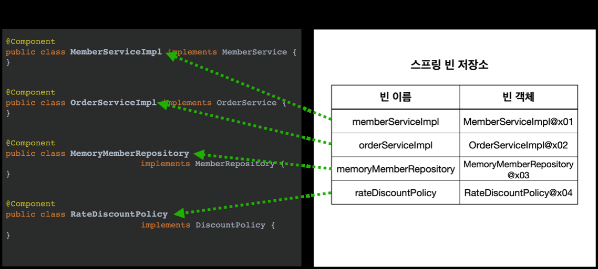
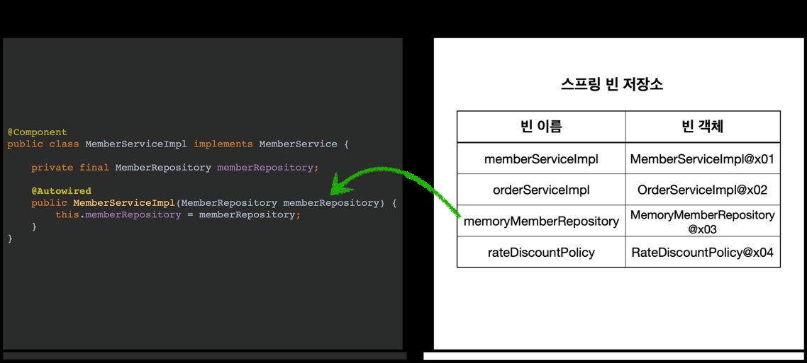

# 학습 목적
개발자가 좋은 객체 지향 애플리케이션을 개발할 수 있도록 도와주는 스프링 프레임워크의 핵심 원리와 기능을 객체 지향 설계의 관점에서 이해한다.

## 학습 목차

- [객체 지향 설계와 스프링](#객체-지향-설계와-스프링)
- [스프링 컨테이너와 스프링 빈](#스프링-컨테이너와-스프링-빈-지향-설계와-스프링)
- [싱글톤 컨테이너](#싱글톤-컨테이너)
- [컴포넌트 스캔](#컴포넌트-스캔)
- [의존관계 자동 주입](#의존관계-자동-주입)
- [빈 생명주기 콜백](#빈-생명주기-콜백)
- [빈 스코프](#빈-스코프)
---
### 객체 지향 설계와 스프링

 #### 좋은 객체 지향 설계로 유명한 5가지 원칙 SOLID가 있다.

- SRP(Single Responsibility Principle) 단일 책임 원칙
    
    한 클래스는 하나의 책임만 가져야 한다. 여기서 책임이라는 것은 기준이 모호하기 때문에 중요한 기준은 **변경**이다.
    변경이 있을 때 파급효과가 적으면 원칙을 잘 지킨 것이다.
    
- OCP(Open/Closed Principle) 개방-폐쇄 원칙

    소프트웨어 요소는 확장에는 열려 있으나 변경에는 닫혀 있어야 한다. 소프트웨어를 설계할 당시에, 다형성을 활용하기 위해 역할과 구현을 인터페이스와 구현체로 나눔으로써
    만족 시킬 수 있다.
    
- LSP(Liskov Substitution Principle) 리스코프 치환 원칙

    프로그램의 객체는 프로그램의 정확성을 깨뜨리지 않으면서 하위 타입의 인스턴스를 바꿀 수 있어야 한다. 단순히 컴파일이 되는 것이 아니라 규약을 지키는것
    
    ex)자동차의 인터페이스인 엑셀은 앞으로 가라는 규약, 뒤로 간다면 위반
    
- ISP(Interface Segregation Principle) 인터페이스 분리 원칙

    특정 클라이언트를 위한 인터페이스 여러 개가 범용 인터페이스 한개 보다 낫다. 인터페이스가 명확해지고, 대체 가능성이 높아진다는 장점을 가진다.
  
- DIP(Dependency Inversion Principle) 의존관계 역전 원칙

    프로그래머는 **구체화가 아닌, 추상화에 의존해야 한다**. 대표적으로 의존성 주입이 이 원칙을 따르는 방법중 하나다. 구체 클래스가 아닌 인터페이스에 의존해야 한다는 의미이다.
    
 #### 스프링에서 왜 객체 지향이 언급될까?
 
- 사실 스프링이 없던 시절에는 개발자가 객체 지향 설계 원칙을 지키면서 개발하기에 매우 할일이 많았다. 결국 에플리케이션을 주요기능을 개발하는 것보다 이 원칙들을 지키기 위한
개발들에 더 많은 시간을 소비하게 되고, 스프링이라는 프레임워크가 만들어지는 계기가 된다.
-  스프링은 다음과 같은 기술로 다형성 + OCP, DIP를 가능하게 지원한다.
  
    - DI(Dependency Injection): 의존관계 주입
    - DI 컨테이너 제공

-  클라이언트 코드의 변경 없이 기능 확장
-  애플리케이션을 개발하는 과정에서 부품을 교체하듯이 개발

 #### 클래스 모델링
 
 
 - OrderService라는 역할과 구체인 OrderServiceImpl을 나눔
 - OrderServiceImpl은 저장소인 MemberRepository와 할인정책인 DiscountPolicy
 - 결과적으로 OrderServiceImpl이라는 클라이언트는 어떤 저장소와 할인정책을 사용할지 모르고 외부에서 설정한 것들을 사용하게 되어있음
 - DIP 의존관계 역전 원칙을 지켰다고 할 수 있다. 
 
 #### DI 컨테이너 실제 코드
```java
public class AppConfig {

    public MemberService memberService() {
        return new MemberServiceImpl(memberRepository());
    }

    private MemberRepository memberRepository() {
        return new MemoryMemberRepository();
    }

    public OrderService orderService() {
        return new OrderServiceImpl(
                memberRepository(),
                discountPolicy());
    }

    public DiscountPolicy discountPolicy() {
        return new FixDiscountPolicy();
    }

}
```
- 스프링 컨테이너를 사용하지 않은 순수 자바코드로써 객체를 생성하고 의존관계를 주입하였다.
- AppConfig와 같은 설정 정보가 만들어져 있다면 **실제 코드를 변경하지 않고 필요한 기능을 이곳에 추가**할 수 있다.
---

### 스프링 컨테이너와 스프링 빈

#### OrderApp.java 와 MemberApp.java에 스프링 컨테이너 생성후 적용
```
ApplicationContext applicationContext =new AnnotationConfigApplicationContext(AppConfig.class);
```
- ApplicationContext는 스프링 컨테이너의 인터페이스고 자바 기반 설정클래스인 AppConfig를 구현체인 AnnotationConfigApplicationContext로써 생성했다.

#### 스프링 컨테이너의 생성과정
1. 스프링 컨테이너 생성



   - 바로 직전 컨테이너 생성 코드를 통해 스프링 컨테이너가 생성되었고 빈 저장소는 비어있다.


2. 스프링 빈 등록



   - AppConfig에 @Bean 어노테이션이 붙은 자바 메소드를 호출하여 스프링 빈을 등록한다.
    

3. 스프링 빈 의존관계 설정


    
   - 컨테이너 설정 정보를 참고해서 의존관계를 주입 한다.
   - 단순히 이전에 자바코드로써 의존관계를 주입한 것에 비해 스프링 컨테이너는 싱글톤 컨테이너 이다.

#### 컨테이너에 등록된 빈 조회 테스트
- core/test/java/OOP.core/beanfind  
    - getBeanDefinitionNames() : 컨테이너에 등록된 모든 빈 이름들 반환
    - getBean() : 등록된 빈의 객체 주소 값 반환, 빈 이름 또는 타입으로 조히 가능
    - getRole() : 스프링에서 정한 빈 역할을 반환
                
        ROLE_APPLICATION: 직접 등록한 애플리케이션 빈
        ROLE_INFRASTRUCTURE: 스프링이 내부에서 사용하는 빈
    - getBeansOfType(): 특정 빈 타입 모두 반환

#### BeanFactory와 ApllicationContext


- BeanFatory

    - 스프링 컨테이너 최상위 인터페이스로써,  스프링 빈을 관리하고 조회하는 역할을 담당한다.
    - getBean()을 제공한다.

- ApplicationContext

    - BeanFactory 기능을 모두 상속받아서 제공할 뿐만 아니라, 메시지 소스 국제화, 환경변수, 어플리케이션 이벤트, 편리한 리소스 조회와 같은
    다양한 기능 또한 제공한다.
    
#### 다양한 설정 형식 지원


- 스프링은 BeanDefintion이라는 **빈 설정 메타정보**를 추상화 시켰기 떄문에 다양한 설정 형식을 지원한다.
- 이러한 기능을 설계한 것 역시 객체 지향 설계라고 할 수 있다.

---
### 싱글톤 컨테이너

####싱글톤 패턴

- 스프링 컨테이너가 아닌 순수 자바로 만든 DI 컨테이너는 클라이언트가 요청을 할 때 마다 객체를 새로 생성해야 한다. 이것은 심한 메모리 낭비를 발생 시킨다. 따라서 사용할 객체를 미리 한개만 만들어놓고 모두가 공유하도록 설계하여야 한다.
- 스프링 컨테이너 없이 순수 자바 코드로 싱글톤 패턴을 만족 시키려면 일일히 모든 코드에 private 생성자를 넣어 주어야 한다.
이렇게 되면, 클라이언트 코드가 구체 클래스를 의존하게 되어 DIP를 위반 할 뿐만 아니라, 새로운 구체를 사용할 때마다 의존관계를 클라이언트 코드에서 주입해주어야 하기 떄문에
OCP를 위반하게 되어 코드의 유연성이 떨어지게 된다.
- 따라서 스프링 컨테이너는 본래 순수 자바 싱글톤 패턴의 문제점을 해결하면서 객체 인스턴스를 싱글톤으로 관리하도록 도와준다.

    
 
 #### 싱글톤 방식 주의점
 
 - 싱글톤 객체를 설계할 때, 무상태로 설계해야 한다.
    - 특정 클라이언트에 의존적인 필드가 있으면 안된다.
    - 특정 클라이언트가 값을 변경할 수 있는 필드가 없어야 한다.
    - 가급적 읽기만 가능해야 한다.
 - @Configuration 어노테이션이 있어야 싱글톤을 보장한다.
    - 이 어노테이션이 없다면 이미 존재하는 빈을 체크하고 같은 인스턴스에 대해 또 다시 호출하게 되어 싱글톤을 보장하지 않는다.
    - 이 어노테이션은 해당 설정 정보를 상속받는 클래스를 따로 만들어서 등록할 빈의 중복체크를 하는 코드가 동적을 생성된다.

---
### 컴포넌트 스캔

#### @ComponentScan, @Component, @Autowired

- 만약 스프링 컨테이너에 등록해야할 스프링 빈이 엄청나게 많아지면 이전의 설정 정보 클래스파일이 점점 거대해지고, 실수를 할 수도 있다.
- 그래서 스프링은 자동으로 스프링 빈을 등록하는 컴포넌트 스캔이라는 기능을 제공하고 DI도 자동으로 해주는 기능도 제공한다.
- 설정 정보 파일에 @ComponentScan 어노테이션을 붙여 주면 된다. 물론 싱글톤을 유지하기 위해 @Configuration도 사용해야 한다.
- 이후 컴포넌트 스캔의 대상이될 클래스에 @Component 어노테이션을 붙여주면 된다.

   

    - 빈 이름은 클래스 앞글자를 소문자로하고 등록된다.
    - 스프링 빈의 이름을 지정하고 싶다면 @Component("NAME") NAME에 넣고 싶은 이름을 넣으면 된다.

   
   
   - 생성자에 @Autowired를 지정하면 스프링 컨테이너가 자동으로 해당 빈을 찾아서 의존 관계를 주입한다.
   - getBean()과 동일하다고 할 수 있다.
  
#### 컴포넌트 스캔 기본 대상

- @Component: 컴포넌트 스캔에서 사용
- @Controller: 스프링 MVC 컨트롤러로 인식
- @Service: 스프링 비즈니스 로직계층으로 인식
- @Repository: 스프링 데이터 접근 계층으로 인식하고, 데이터 계층의 예외를 스프링 예외로 변환해준다.
- @Configuration: 스프링 설정 정보로 인식하고, 싱글톤 유지하도록 추가 처리한다.

#### 중복 등록과 충돌

- 수동 등록과 자동 등록에서 이름이 겹친다면 수동 등록을 우선시 등록하고 겹치는 자동 등록은 오버라이딩 된다.
- 스프링 부트 실행시 오류가 발생한다.

---

### 의존관계 자동 주입

#### 방법
- @Autowired는 생성자가 한개만 있다면 생략가능
```
    /**
     * 필드 주입
     */
    //@Autowired
    private final MemberRepository memberRepository;
    private final DiscountPolicy discountPolicy; //DIP 원칙을 위배하지 않음

    /**
     * 생성자 주입
     */
    public OrderServiceImpl(MemberRepository memberRepository, @MainDiscountPolicy DiscountPolicy discountPolicy) {
        this.memberRepository = memberRepository;
        this.discountPolicy = discountPolicy;
    }

    /**
     * 일반 메서드 주입
     */
    @Autowired
    public void init(MemberRepository memberRepository, DiscountPolicy discountPolicy) {
        this.memberRepository = memberRepository;
        this.discountPolicy = discountPolicy;
    }


    /**
     * 세터주입
     */
    @Autowired
    public void setMemberRepository(MemberRepository memberRepository) {
        this.memberRepository = memberRepository;
    }

    @Autowired
    public void setDiscountPolicy(DiscountPolicy discountPolicy) {
        this.discountPolicy = discountPolicy;
    }
```
- 생성자 주입
    - 불변, 필수 의존관계에 사용
- 수정자(세터) 주입
    - 선택, 변경 가능성이 있는 의존관계에 사용
- 필드 주입
    - 코드가 간결하지만, 변경이 불가능하여 테스트가 힘들다
    - DI 프레임워크가 없으면 아무것도 할 수 없다.
    - @Configuration 같은 곳에서만 특별한 용도로 사용
- 일만 메서드 주입
    - 한번에 여러 필드를 주입 받을 수 있다.
    - 일반적으로 잘 사용하지 않음

#### 자동, 수동의 올바를 실무 운영 기준

- 편리한 자동 기능을 기본으로 사용하자
- 수동 빈은 애플리케이션에 광범위하게 영향을 미치는 기술 지원 객체를 수동 빈으로 등록하자
- 또는 비즈니스 로직중에서 다형성을 적극 활용할 때 해당 객체들을 특정 패키지에 묶어서 관리하자.

### 빈 생명주기 콜백

- 스프링 빈은 객체 생성 -> 의존관계 주입의 생명주기를 가진다.
- 스프링은 의존관계 주입이 완료되면 스프링 빈에게 콜백 메서드를 통해 초기화 시점을 알려주고, 스프링이 종료되기 직전에 소멸 콜백을 주는 다양한 기능을 제공한다.
- 스프링 컨테이너 생성 -> 스프링 빈 생성 -> 의존관계 주입 -> 초기화 콜백 -> 사용 -> 소멸전 콜백 -> 스프링종료
    - 초기화 콜백: 빈이 생성되고, 빈의 의존관계 주입이 완료된 후 호출
    - 소멸전 콜백: 빈이 소멸되기 직전에 호출
- 스프링은 크게 3가지 방법으로 빈 생명주기 콜백을 지원한다.
    - 인터페이스(InitializingBean, DisposableBean)
        - 스프링 전용 인터페이스이기 때문에 스프링 전용 인터페이스에 의존한다.
        - 메서드의 이름을 변경할 수 없다.
        - 내가 고칠 수 없는 외부 라이브러리에 적용할 수 없다.
    - 설정 정보에 초기화, 종료 메서드 지정
        ```
        @Bean(initMethod = "init", destroyMethod = "close")
        ```
      - 메서드 이름이 자유롭고, 스프링 코드에 의존하지 않는다.
      - 외부 라이브러리에도 초기화, 종료 메서드를 적용할 수 있다.
      - destroyMethod는 추론 기능이 있어서 close,shutdown이라는 이름의 메서드를 자동 호출해준다. 이 기능은 사용하지 않을 수 있다.
    - @PostConstruct, @PreDestroy 애노테이션 지원
        - 해당 메서드에 이 애노테이션을 붙이면 된다.
        - 스프링에서 가장 권장하는 방법이다.
        - 자바 표준 기술이다.
        - 외부 라이브러리에 적용하지 못한다는 유일한 단점이 있다.
### 빈 스코프
